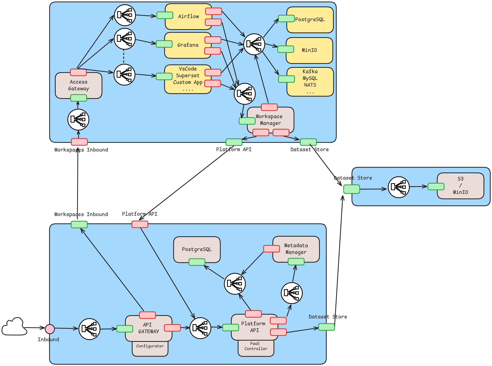

# Project: Proof of Concept (PoC) Implementation of a Data Analysis Platform as a Multitenant Service in the Cloud

## Project Title:
**Design of a Data Analysis Platform as a Multitenant Service in the Cloud: An Approach towards Scalability and Adaptability**

## Project Overview:
This project represents the Proof of Concept (PoC) implementation for a [master's thesis](https://drive.google.com/file/d/143Lb2sxD9aHuM76DdIftMONdc6IuTBWb/view?usp=sharing) aimed at designing and developing a scalable and adaptable Data Analysis Platform as a Service (DAPaaS). The project implements various components and services required for multitenancy in the cloud, focusing on scalability and ease of management. It is structured around several microservices and utilizes containerized environments through Docker.

All Docker images for this project have been published under the [salvachll/...](https://hub.docker.com/u/salvachll) namespace in Docker Hub, and the deployment manifests are publicly available via npm at [salvachillo.dapaas/...](https://www.npmjs.com/org/salvachillo.dapaas)

## Project Structure:

### 1. **component-implementation**
This directory contains the implementations of various core components of the DAPaaS system, each having its own Dockerfile to enable containerization.

- **access-gateway**: Manages user authentication and authorization for the platform, ensuring secure access to the Users' Workspaces. As a trusted component, it enforces access control policies and isolates user actions to prevent unauthorized access.

- **airflow**: Implements workflow automation using Apache Airflow. It allows users to orchestrate data workflows and manage data pipelines. This component is non-trusted but essential for handling user-driven processes.

- **apisix**: Implements the API Gateway, which is the primary entry point for all incoming requests to the platform. It handles request routing and integrates with the Access Gateway to ensure secure access. This is a trusted component responsible for secure and efficient routing.

- **dapaas-api-gateway-configurator**: Dynamically configures the API Gateway, ensuring it integrates correctly with the platform’s underlying infrastructure (such as Kubernetes). This trusted component guarantees proper configuration, ensuring secure and efficient API request routing.

- **data-platform**:
  - **Platform Core API**: This is the main API that interacts with the platform’s functionalities, including dataset management and user session handling. As a trusted component, it ensures secure data access and operation management.
  - **UI**: Implements the user interface for interacting with the platform. The UI provides users with a graphical way to manage datasets, sessions, and analysis tasks.
  - **Workspace Manager**: Manages the Users’ Workspaces, handling the integration between the tools within the workspace and the platform. It is responsible for the secure loading and saving of datasets between the central dataset store and the workspace.

- **dex**: Provides identity management through the Dex service, integrating with the Access Gateway to handle secure user authentication across the platform.

- **fsync**: Manages file synchronization services within the platform, allowing users to securely transfer data across different components. It is responsible for ensuring consistency and security in file operations.

- **fsync-client**: The client-side counterpart of the `fsync` service, handling interactions with the file synchronization system.

- **grafana**: Provides data visualization and monitoring services. This non-trusted component is essential for displaying data analytics but does not handle sensitive operations like data access control.

- **minio**: Implements scalable, S3-compatible object storage for managing datasets within the platform. As a trusted component, it securely stores datasets and ensures authorized access.

- **postgres**: Manages the DAPaaS Core Database, which stores critical platform-related data such as user and tenant information, configuration settings, and metadata. This is a trusted component ensuring the integrity and security of platform data.

- **redis**: Provides in-memory data storage for caching and quick access to platform data. It supports various platform functionalities and improves overall performance.

- **vscode**: Implements a development environment service using Visual Studio Code server, allowing users to interact with the platform through a familiar coding environment within the Users' Workspace.

### 2. **deployment-manifests**
This directory contains Kubernetes manifests for deploying the various components of the platform.

- **components/**: Each folder here corresponds to a specific component manifest of the platform, such as:
  - `access-gateway-component`
  - `airflow-service`
  - `api-gateway-component`
  - `dapaas-api-component`
  - `dex-component`, and others.
- **deployments/**: Manifests for deploying the full DAPaaS platform (`dapaas-deployment`) and user workspace service (`workspace-deployment`).
- **services/**: Definitions for core services such as:
  - `core-service`
  - `dapaas-service`
  - `dataset-store-service`
  - `user-workspace-service`

## How to Get Started:
1. Clone the repository to your local machine.
2. Navigate to each component's directory and use the provided Dockerfiles to build and run the respective services.
3. Use the deployment manifests within `deployment-manifests/dapaas-deployment` to deploy the entire platform Axebow.

## Key Technologies Used:
- Docker: For containerizing services.
- Kumori/Axebow: For managing the deployment of services.
- Apache APISIX: API gateway management.
- Apache Airflow: Workflow automation.
- Dex: Identity management.
- PostgreSQL, Redis, MinIO: Storage and database services.
- Grafana: Monitoring and visualization.

This project is designed to provide a scalable, multitenant cloud environment for data analysis, aiming to balance performance, security, and adaptability for different tenant needs.